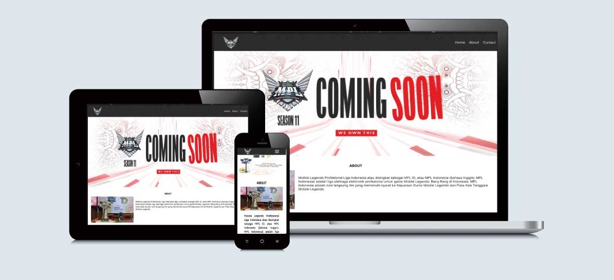
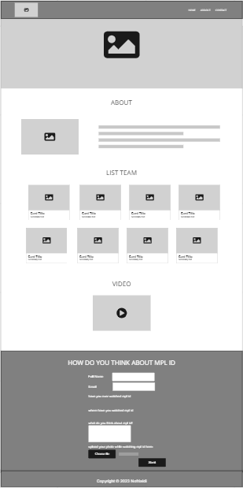
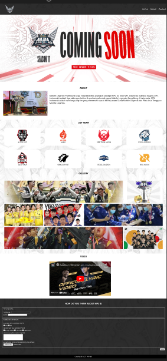

# LANDING PAGE MPL INDONESIA

> Assignment for Landing Page Website.

## Links/URLs:

- Access Live <https://w3-landing-website-nofrialdi.netlify.app/>

# Description

## Used Tools:

## UI/UX

Link figma : <https://www.figma.com/file/0PabRvR4leAsJv5iGBmXBu/mpl?node-id=0%3A1&t=nHMk0EPr51PMPSIw-1/>

Link miro : <https://miro.com/app/board/uXjVPr3v34U=/>

|       **Miro**       |         **figma**          |
| :------------------: | :------------------------: |
|  |  |

## Display the mpl id website from various types of devices:

|             **small phone**              |       **medium phone**       |
| :--------------------------------------: | :--------------------------: |
|  |  |

|          **tablet**          |       **laptop / PC**        |
| :--------------------------: | :--------------------------: |
|  |  |
